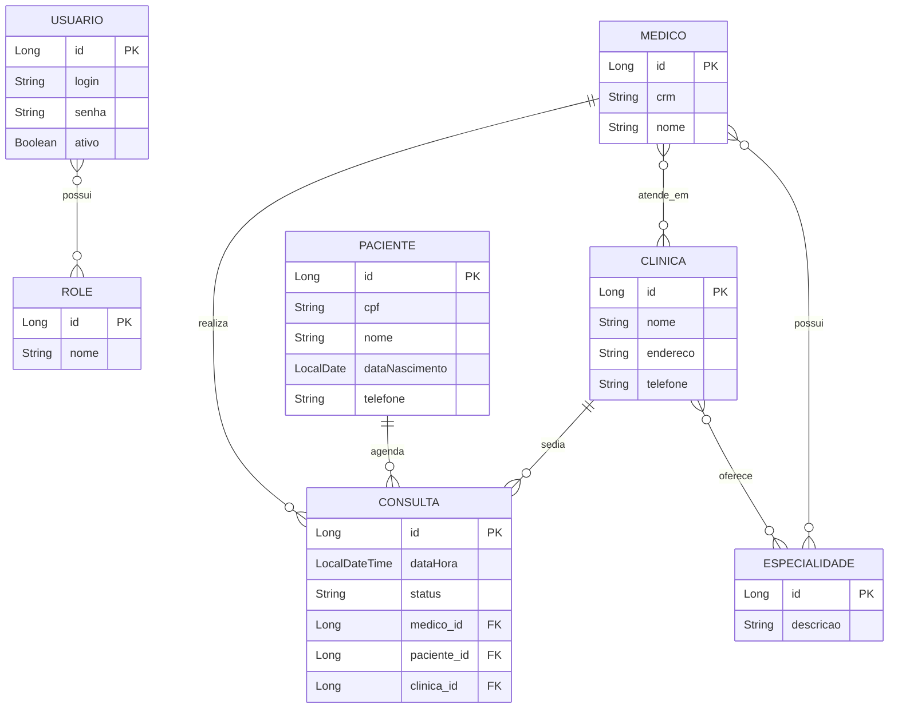

# Instituto Federal de Sergipe
# Disciplina: Programação I — Prof. Francisco Rodrigues
# Alunos: Fabiano Freitas e Aline Santos

# Sistema de Agendamento de Clínicas

## Sumário
- [Domínio do problema](#domínio-do-problema)
- [Solução proposta](#solução-proposta)
- [Tecnologias utilizadas](#tecnologias-utilizadas)
- [Modelo de dados (DER)](#modelo-de-dados-der)
- [Como executar localmente](#como-executar-localmente)
- [Autenticação](#autenticação)
- [Papéis e permissões](#papéis-e-permissões)
- [Exemplo de execução](#exemplo-de-execução)
- [Documentação da API (Swagger)](#documentação-da-api-swagger)

---

## Domínio do problema

Clínicas médicas precisam controlar, de forma centralizada, quais médicos atendem em quais unidades, quais especialidades cada médico possui, e o agendamento de consultas entre pacientes e médicos. Sem um sistema, esse controle costuma ser feito em planilhas ou agendas físicas, o que dificulta consultar rapidamente a agenda de um médico, o histórico de um paciente, ou quais clínicas oferecem determinada especialidade.

## Solução proposta

Uma API REST construída em Spring Boot que permite:

- Cadastrar **clínicas**, **médicos**, **pacientes** e **especialidades**;
- Relacionar médicos a múltiplas clínicas e especialidades (N:N);
- Agendar **consultas**, vinculando médico, paciente e clínica em um único registro;
- Consultar o histórico de consultas por paciente ou por médico;
- Proteger todas as rotas de escrita com autenticação via **JWT** e autorização por papel (`ADMIN`, `MEDICO`, `PACIENTE`);
- Documentar automaticamente todos os endpoints via **Swagger/OpenAPI**.

## Tecnologias utilizadas

| Camada | Tecnologia |
|---|---|
| Linguagem | Java 21 |
| Framework | Spring Boot 3.5.x |
| Persistência | Spring Data JPA + H2 (banco em memória) |
| Validação | Bean Validation (Jakarta Validation) |
| Segurança | Spring Security + JWT (jjwt 0.12.5) |
| Documentação | springdoc-openapi (Swagger UI) |
| Build | Maven |

## Modelo de dados (DER)



**Relacionamentos 1:N:** Clínica→Consulta, Médico→Consulta, Paciente→Consulta.
**Relacionamentos N:N:** Clínica↔Especialidade, Médico↔Especialidade, Médico↔Clínica, Usuário↔Role.

## Como executar localmente

### Pré-requisitos
- JDK 21
- Maven 3.9+ (ou usar o `mvnw` incluso, se houver)

### Passos

```bash
# 1. Clonar o repositório
git clone <url-do-repositorio>
cd clinica

# 2. Rodar a aplicação
mvn spring-boot:run
```

A aplicação sobe em `http://localhost:8080`.

- **Swagger UI:** http://localhost:8080/swagger-ui.html
- **Console do H2:** http://localhost:8080/h2-console
  - JDBC URL: `jdbc:h2:mem:clinicadb`
  - Usuário: `sa` / Senha: *(em branco)*

O banco é populado automaticamente na inicialização via `data.sql` (roles e usuário `admin`).

## Autenticação

O usuário administrador padrão é criado pelo `data.sql`:

| login | senha |
|---|---|
| admin | admin123 |

Todas as rotas, exceto `/api/auth/**` e as do Swagger, exigem um token JWT no header:

```
Authorization: Bearer <token>
```

## Papéis e permissões

O sistema define 3 papéis (`Role`), atribuídos ao `Usuario` que faz login: `ADMIN`, `MEDICO` e `PACIENTE`. As permissões são aplicadas por rota via `@PreAuthorize` em cada controller.

| Recurso | Ação | ADMIN | MEDICO | PACIENTE |
|---|---|:---:|:---:|:---:|
| Clínicas | Listar / Buscar por id | ✅ | ✅ | ❌ |
| Clínicas | Criar / Atualizar / Excluir | ✅ | ❌ | ❌ |
| Médicos | Listar / Buscar por id | ✅ | ✅ | ❌ |
| Médicos | Ver especialidades de um médico | ✅ | ✅ | ❌ |
| Médicos | Criar / Atualizar / Excluir | ✅ | ❌ | ❌ |
| Pacientes | Listar / Buscar por id | ✅ | ✅ | ❌ |
| Pacientes | Criar / Atualizar / Excluir | ✅ | ❌ | ❌ |
| Especialidades | Listar / Buscar por id | ✅ | ✅ | ❌ |
| Especialidades | Criar / Atualizar / Excluir | ✅ | ❌ | ❌ |
| Consultas | Listar todas / Buscar por id | ✅ | ✅ | ✅ |
| Consultas | Listar por paciente | ✅ | ✅ | ✅ |
| Consultas | Listar por médico | ✅ | ✅ | ❌ |
| Consultas | Agendar / Atualizar / Excluir | ✅ | ❌ | ❌ |
| Login (`/api/auth/login`) | — | público (sem token) | público | público |
| Swagger / OpenAPI | — | público | público | público |

**Observações importantes:**
- Todo cadastro (POST/PUT/DELETE) de Clínica, Médico, Paciente, Especialidade e Consulta é restrito ao `ADMIN`. Médico e Paciente têm apenas acesso de leitura, incluindo às próprias consultas.
- As rotas de listagem por paciente/médico (`/api/consultas/paciente/{id}` e `/api/consultas/medico/{id}`) **não verificam se o solicitante é o dono do recurso** — qualquer usuário autenticado com a role permitida pode consultar o histórico de qualquer paciente/médico pelo id, não apenas o seu próprio. Isso é uma limitação conhecida do escopo atual.
- Não há endpoint de cadastro de novos usuários nem vínculo entre `Usuario` e `Medico`/`Paciente`; o único usuário disponível hoje é o `admin` semeado via `data.sql`. Roles `MEDICO`/`PACIENTE` existem no modelo mas não têm um usuário de exemplo para teste.

## Exemplo de execução

### 1. Login

**Requisição** — `POST /api/auth/login`
```json
{
  "login": "admin",
  "senha": "admin123"
}
```

**Resposta** — `200 OK`
```json
{
  "token": "eyJhbGciOiJIUzI1NiJ9.eyJzdWIiOiJhZG1pbiIsInJvbGVzIjpbIlJPTEVfQURNSU4iXX0...."
}
```

### 2. Cadastrar uma clínica

**Requisição** — `POST /api/clinicas`
```json
{
  "nome": "Clínica Vida Nova",
  "endereco": "Av. Central, 100",
  "telefone": "(79) 99999-0000"
}
```

**Resposta** — `201/200 OK`
```json
{
  "id": 1,
  "nome": "Clínica Vida Nova",
  "endereco": "Av. Central, 100",
  "telefone": "(79) 99999-0000"
}
```

### 3. Agendar uma consulta

**Requisição** — `POST /api/consultas`
```json
{
  "dataHora": "2026-08-10T14:00:00",
  "status": "AGENDADA",
  "medicoId": 1,
  "pacienteId": 1,
  "clinicaId": 1
}
```

**Resposta** — `200 OK`
```json
{
  "id": 1,
  "dataHora": "2026-08-10T14:00:00",
  "status": "AGENDADA",
  "medico": { "id": 1, "nome": "Dra. Ana Souza" },
  "paciente": { "id": 1, "nome": "João Lima" },
  "clinica": { "id": 1, "nome": "Clínica Vida Nova" }
}
```

## Documentação da API (Swagger)

Com a aplicação em execução, acesse:

```
http://localhost:8080/swagger-ui.html
```

Lá é possível autenticar (botão **Authorize**) e testar todos os endpoints interativamente, seguindo o roteiro de testes descrito em `roteiro_testes_swagger.md`.
