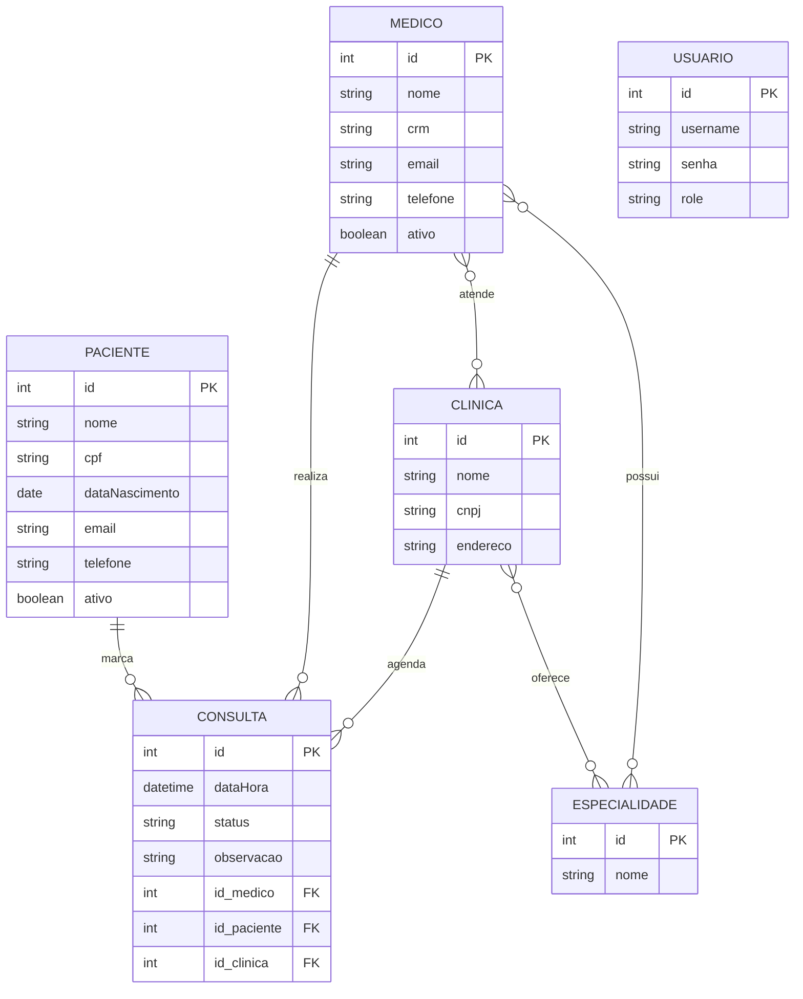

# Diagrama ER — Sistema Mais Saúde

### Legenda dos relacionamentos

- **1:N** — `CLINICA ||--o{ CONSULTA`, `MEDICO ||--o{ CONSULTA`, `PACIENTE ||--o{ CONSULTA`
- **N:N** — `MEDICO }o--o{ ESPECIALIDADE` (tabela `medico_especialidade`), `MEDICO }o--o{ CLINICA`
  (tabela `medico_clinica`), `CLINICA }o--o{ ESPECIALIDADE` (tabela `clinica_especialidade`)

`USUARIO` não se relaciona com as demais entidades — é usado apenas para autenticação/autorização
(login e papel ADMIN/USER), não faz parte do domínio de negócio (clínicas/médicos/pacientes/consultas).
